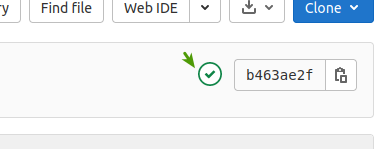
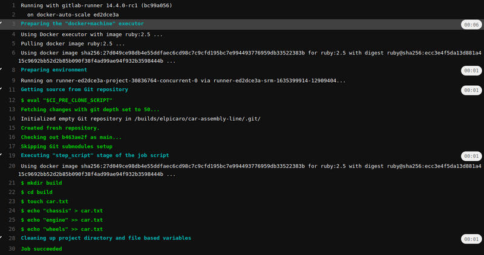
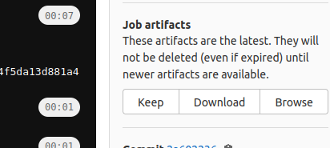

<!-- START doctoc -->
<!-- END doctoc -->

# Notes on gitlab-ci-pipelines-ci-cd-and-devops-for-beginners on udemy

## Intro

### Your first pipeline

Build -> Test

- Create gitlab project
- click on "Set up CI/CD" or create a `.gitlab-ci.yml` file in the base of the project manually

Example:

    # name of job (task:)
    build the car:
      script:
        # shell commands 
        - mkdir build
        - cd build
        - touch car.txt
        - echo "chassis" > car.txt
        - echo "engine" >> car.txt
        - echo "wheels" >> car.txt

Commit the file and gitlab will detect the pipeline. An indicator (running, passed, failed) will be visible in the main project view on the upper right:

Clicking on the indicator and then on the job ("build the car") in the lower half - a pipeline can contain multiple jobs - the pipeline's output is displayed:

We can specify multiple jobs, so we'll add a test job:

    build the car:
    [...]
    test the car:
        script:
            # test if file exists
            # it will fail the pipeline if it doesn't
            - test -f build/car.txt
            - cd build
            - grep "chassis" car.txt
            - grep "engine" car.txt
            - grep "wheels" car.txt

By default, gitlab tries to execute jobs in parallel. Here, we want the test job to be run *after* building the car. The order can be defined using `stages` with arbitrary names and assigning these to each job:

    stages:
        - build
        - test
    build the car:
        stage: build
        script:
        [...]
    
    test the car:
        stage: test
        [...]

In this example, the test job will fail as by default, jobs in a pipeline don't exchange any data (so the `car.txt` file created in "build the car" will not exist in "test the car) *unless so defined in the yaml file*. This means the file created in one job are removed when it is finished, or rather the environment / container that the job ran in is destroyed upon completion.

To tell a job what to save, we need to define an `artifacts`:

    [...]
    build the car:
        [...]
        artifacts:
            paths:
                # save entire folder
                - build/
    [...]

For jobs that create artifacts, the files can be downloaded in the  CI/CD->Jobs view:

or in the job output view.

These files are **not** added to the git project repository itself.

Full pipeline:

    stages:
        - build
        - test
    build the car:
        stage: build
        script:
            # shell commands 
            - mkdir build
            - cd build
            - touch car.txt
            - echo "chassis" > car.txt
            - echo "engine" >> car.txt
            - echo "wheels" >> car.txt
        artifacts:
            paths:
                # save entire folder
                - build/
    
    test the car:
        stage: test
        script:
            # test if file exists
            # it will fail the pipeline if it doesn't
            - test -f build/car.txt
            - cd build
            - grep "chassis" car.txt
            - grep "engine" car.txt
            - grep "wheels" car.txt

